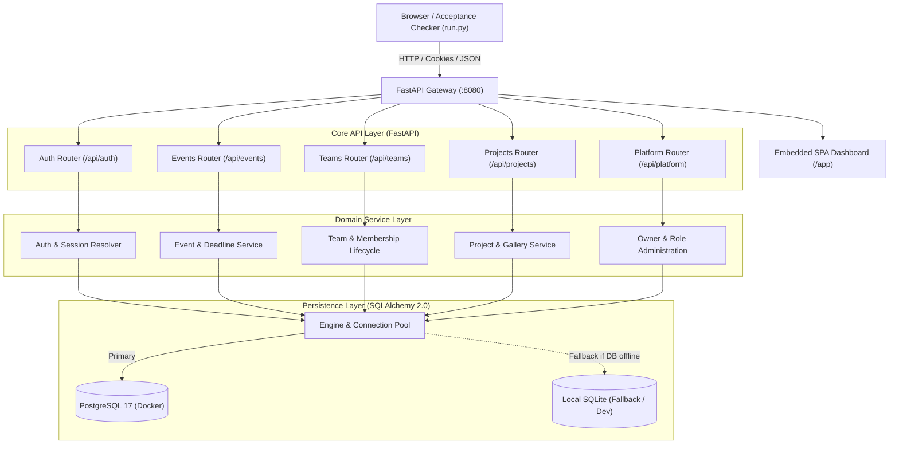
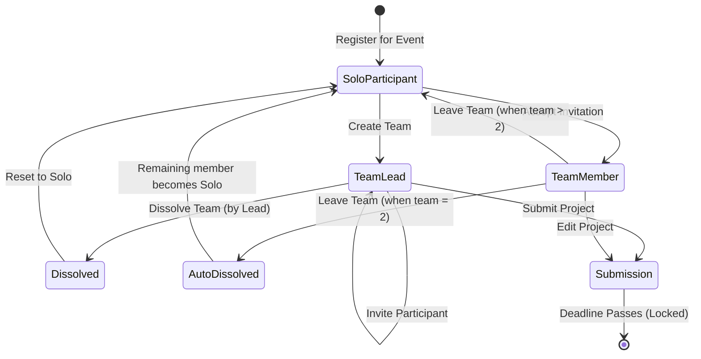

# Architecture Overview — DOGFOOD 2026

## 1. System Philosophy & Objectives

The DOGFOOD Hackathon Platform is designed around three principles:
1. **Self-Contained & Deterministic**: Runs entirely with `docker compose up` with the network off. No cloud services or proprietary third-party APIs required.
2. **Strict Defense in Depth**: Deadline gating, role checks, and score privacy are enforced at the API/database layer, never relying purely on client-side button hiding.
3. **Pluggable & Modular**: Clean separation between Routers, Services, Schemas, and ORM Models allows extending from Tier 1 to Tier 4 without architectural rewrites.

---

## 2. High-Level Architecture Diagram



---

## 3. Technology Stack

- **Backend Framework**: [FastAPI](https://fastapi.tiangolo.com/) (Python 3.12+) with [Uvicorn](https://www.uvicorn.org/).
- **Data Validation & Serialization**: [Pydantic v2](https://docs.pydantic.dev/latest/).
- **Object Relational Mapper**: [SQLAlchemy 2.0](https://www.sqlalchemy.org/).
- **Database**:
  - Production: Self-hosted [PostgreSQL 17](https://www.postgresql.org/) with Row Level Security (RLS).
  - Development / Offline: Automatic SQLite fallback (`portal.db`).
- **Frontend**: Clean single-page application (SPA) built with modern HTML5, CSS Grid/Flexbox, and vanilla JavaScript (no build step or node_modules required).
- **Packaging & Orchestration**: Multi-stage Docker image and `docker-compose.yml`.

---

## 4. Security & Role Architecture

The platform cleanly decouples **Platform-Level Roles** from **Event-Level Roles**:

```
+-----------------------------------------------------------+
| PLATFORM LEVEL                                            |
|   - Platform Owner: System administration, organizer promo|
|   - Platform Organizer: Can create new hackathon events   |
|   - Platform User: Normal registered participant          |
+-----------------------------------------------------------+
                             |
                             v
+-----------------------------------------------------------+
| EVENT LEVEL                                               |
|   - Event Owner: Created the event; full event control    |
|   - Event Organizer: Co-organizer of the event            |
|   - Event Judge: Invited & assigned to evaluate tracks    |
|   - Event Participant: Registered attendee                |
+-----------------------------------------------------------+
```

### Authentication & Token Resolution
FastAPI dependencies (`get_current_user`, `require_session`) resolve identities from:
1. `Cookie: session=<token>` (Standard web sessions and DOGFOOD acceptance suite).
2. `Authorization: Bearer <token>` (API clients).
3. Session tokens map directly to seeded fixture sessions (`org_7f2a`, `jdg_a_91bc`, `jdg_b_44de`, `prt_2e88`).

---

## 5. Team Lifecycle & State Machine



### Invariant Rules
- **Cap Enforcement**: Teams cannot exceed `event.max_team_size`.
- **Solo Protection**: If `max_team_size == 1`, team formation is locked and all participants compete individually.
- **Auto-Dissolution**: If a member leaves a 2-person team, the team automatically dissolves so that the last remaining member is released as a solo participant rather than being stuck in a single-person team.
- **Deadline Lockout**: Once `submissions_close` has passed, team formation, leaving, and project updates are blocked.

---

## 6. Deadline Enforcement Mechanism

Deadlines are validated server-side on all write paths:
```python
def check_deadline(event: Event):
    now = datetime.now(timezone.utc)
    if event.submissions_close and now > event.submissions_close:
        raise HTTPException(
            status_code=400,
            detail="Submissions are closed for this event."
        )
```
- Client-side countdown timers update in real time.
- Organizer deadline modifications are converted to UTC ISO 8601 timestamps with millisecond accuracy.
