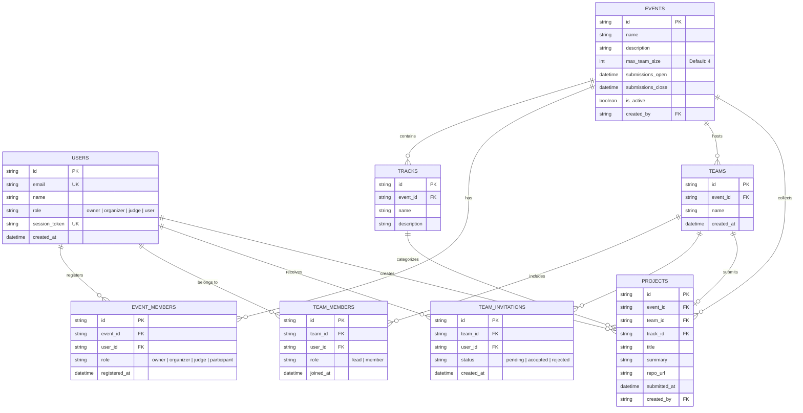

# Data Model — DOGFOOD 2026

This document specifies the database schemas, relationships, constraints, and fixture mappings used in the DOGFOOD Hackathon Platform.

---

## 1. Entity-Relationship Diagram

---

## 2. Table Specifications

### `users`
Represents all accounts across the platform.
| Column | Type | Nullable | Details |
| :--- | :--- | :--- | :--- |
| `id` | `VARCHAR(64)` | No | Primary Key (`usr_*` or `jdg_*`). |
| `email` | `VARCHAR(255)` | No | Unique index. |
| `name` | `VARCHAR(255)` | No | User display name. |
| `role` | `VARCHAR(32)` | No | Platform role (`owner`, `organizer`, `judge`, `user`). |
| `session_token` | `VARCHAR(255)` | Yes | Session token matching DOGFOOD cookies. |
| `created_at` | `TIMESTAMPTZ` | No | Default UTC timestamp. |

### `events`
Hackathons managed on the platform.
| Column | Type | Nullable | Details |
| :--- | :--- | :--- | :--- |
| `id` | `VARCHAR(64)` | No | Primary Key (`evt_*`). |
| `name` | `VARCHAR(255)` | No | Event title. |
| `description` | `TEXT` | Yes | Markdown-capable event description. |
| `max_team_size` | `INTEGER` | No | Default 4. Immutable after creation. |
| `submissions_open` | `TIMESTAMPTZ` | No | Submissions window open time. |
| `submissions_close` | `TIMESTAMPTZ` | No | Submissions deadline. Writes rejected after this. |
| `is_active` | `BOOLEAN` | No | Toggle event visibility. |
| `created_by` | `VARCHAR(64)` | Yes | Foreign Key -> `users.id`. |

### `teams` & `team_members`
Team groupings formed within an event.
- Cascade rule: Deleting a `team` automatically cascades deletion of its `team_members`, `team_invitations`, and sets `team_id = NULL` on submitted `projects`.
- Uniqueness: A user can belong to at most one team per event.
- Cap: The count of `team_members` for a team cannot exceed `event.max_team_size`.

### `team_invitations`
Invitations sent by team leads to prospective members.
- Validates that the recipient is registered as an `event_member` with role `participant`.
- Prevents inviting members who already belong to another team.

### `projects`
Hackathon project submissions.
| Column | Type | Nullable | Details |
| :--- | :--- | :--- | :--- |
| `id` | `VARCHAR(64)` | No | Primary Key (`prj_*`). |
| `event_id` | `VARCHAR(64)` | No | Foreign Key -> `events.id`. |
| `team_id` | `VARCHAR(64)` | Yes | Foreign Key -> `teams.id` (nullable for solo submissions). |
| `track_id` | `VARCHAR(64)` | Yes | Foreign Key -> `tracks.id`. |
| `title` | `VARCHAR(255)` | No | Project title. |
| `summary` | `TEXT` | Yes | Elevator pitch / description. |
| `repo_url` | `VARCHAR(512)`| Yes | Repository URL. |
| `submitted_at` | `TIMESTAMPTZ` | No | Submission timestamp (UTC). |
| `created_by` | `VARCHAR(64)` | No | Foreign Key -> `users.id`. |

---

## 3. Fixtures Ingestion Mapping

When loading `fixtures.json`, the ingestion pipeline in `src/seed.py` maps data deterministically:

1. **`fixtures["event"]`** -> `events` row (`id="evt_01"`, deadline set to fixture close time).
2. **`fixtures["tracks"]`** -> `tracks` rows with respective IDs.
3. **`fixtures["judges"]`** -> `users` (`jdg_*`) and `event_members` (`role="judge"`).
4. **`fixtures["teams"]`** -> `teams` and `team_members` (lead assigned to first member).
5. **`fixtures["projects"]`** -> `projects` associated with fixture teams and tracks.
